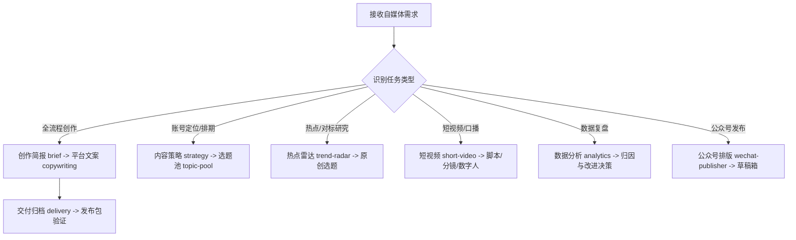

# Self Media Content Workflow (自媒体内容生产与经营工作流套件)

- **项目主页**: https://github.com/yanhua1010/self-media-content-workflow
- **文档指南**: 在执行具体任务或了解详细参数配置前，请先使用 `view_file` 阅读本地 [README.md](./README.md) 及 [skills/self-media-content-workflow/SKILL.md](./skills/self-media-content-workflow/SKILL.md)。

## 🎯 核心法则 (Golden Rules)

1. **总控路由与按需加载**：本套件采用模块化编排架构。Agent 收到自媒体相关任务时，先由总控识别任务类型，按需索引并读取 `skills/` 下的对应子模块，禁止在未经简报确认或无证据支撑时随性批量生成。
2. **多平台原生与证据优先**：同母题共享底层事实与证据，但各平台（微信公众号、小红书、X/Twitter、短视频）必须独立设计标题、开头、视觉与行动，严禁机械缩写或粗暴群发。
3. **人工在环确认机制**：严格遵守 `方向确认 → 平台组合确认 → 标题选择确认 → 终稿确认 → 发布授权` 5 个关键确认点，默认只产出草稿或本地发布包，绝不未经授权直接对外群发。
4. **素材安全与合规底线**：严禁自动化爬取侵犯隐私或使用主账号违规互动；涉及数字人制片时，肖像与声音由用户在合规平台自行选定，本地仅索引制品路径，不记录敏感凭据。

---

## 🧭 子技能矩阵与内部协同 (Sub-Skills Matrix)

当处理特定垂直阶段的任务时，请直接读取并遵循对应模块目录下的 `SKILL.md`：

| 阶段 / 领域 | 核心模块路径 | 职责与产出 |
|---|---|---|
| **总控编排** | [`skills/self-media-content-workflow/SKILL.md`](./skills/self-media-content-workflow/SKILL.md) | 状态流转、任务卡创建、确认点把控与端到端编排 |
| **需求澄清** | [`skills/self-media-content-brief/SKILL.md`](./skills/self-media-content-brief/SKILL.md) | 澄清目标受众、核心判断、证据链与平台表达角度 |
| **内容策略** | [`skills/self-media-content-strategy/SKILL.md`](./skills/self-media-content-strategy/SKILL.md) | 账号定位、栏目规划、选题池建立与月度内容日历 |
| **热点竞品** | [`skills/self-media-trend-radar/SKILL.md`](./skills/self-media-trend-radar/SKILL.md) | 热点追踪、关键词研究、爆款竞品拆解与原创选题 |
| **平台文案** | [`skills/self-media-platform-copywriting/SKILL.md`](./skills/self-media-platform-copywriting/SKILL.md) | 公众号、小红书、X 原生文案及内置 8 套配图风格库 |
| **短视频制作**| [`skills/self-media-short-video/SKILL.md`](./skills/self-media-short-video/SKILL.md) | 口播文案、3秒黄金钩子、分镜脚本与数字人制片方案 |
| **数据复盘** | [`skills/self-media-content-analytics/SKILL.md`](./skills/self-media-content-analytics/SKILL.md) | 单篇/周期数据指标清洗、归因分析与策略迭代动作 |
| **交付归档** | [`skills/self-media-content-delivery/SKILL.md`](./skills/self-media-content-delivery/SKILL.md) | 里程碑版本管理、路径核验与完整发布包打包 |
| **公众号发布**| [`skills/self-media-wechat-publisher/SKILL.md`](./skills/self-media-wechat-publisher/SKILL.md) | Markdown 主题渲染、图片上传、草稿箱写入与小绿书 |

---

## ⚙️ 轨迹驱动执行引擎 (Execution Trajectory)

### 执行步骤：
1. **意图路由与状态初始化**：
   - 检查工作区是否存在正在进行中的任务卡（`self-media/`）。
   - 若用户输入为模糊灵感，优先激活 `self-media-content-brief` 引导用户确认受众与核心判断。
2. **子模块协同调用**：
   - 根据路由分发至对应子模块，使用 `view_file` 查阅子模块的详细执行规范与模板。
3. **确认点拦截与产物交付**：
   - 阶段性成果保存为 Markdown 里程碑文件，报告当前状态（`AWAITING_USER` / `DONE` / `DONE_WITH_CONCERNS`）。

---

## ⚠️ 异常与降级处理模式 (Troubleshooting & Degradation)

- **外部依赖或 API 缺失**：当缺乏特定发布工具或数字人插件时，主动降级为输出**标准本地发布包**（Markdown 文案 + 图片素材 + 标签与元数据清单），不中断核心工作流。
- **信息不全或模糊需求**：单次最多抛出 3 个高影响核心问题（如目标平台、核心受众、预期交付形式），提供合理默认选项供用户快速确认。
