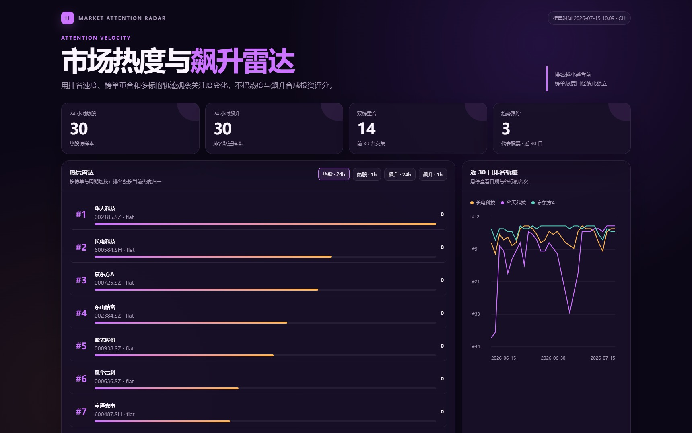

# 市场热度与飙升雷达

> 联动热股榜、飙升榜与排名趋势，观察关注度的层次和变化。

## 定位

快速比较 24 小时榜与小时榜，识别热度高位、排名跃升和短期关注变化；不把热度当成交易信号。

## Prompt 示例

复制下面这一段 Prompt 交给任意支持 Skill 的 Agent。无需克隆本仓库。

```markdown
请使用已安装的 `hithink-finance` Skill，生成一张"市场热度与飙升雷达"看板；不假设本地存在项目仓库。

### 数据任务

1. 优先使用 `hithink-finance` CLI，检查 capabilities，并按需读取 `schema special.hot-stock`、`schema special.skyrocket` 和 `schema special.hot-stock-trend`。
2. 分别获取热股榜与飙升榜的 `day`、`hour` 数据；对热股榜前 3 名再查询近 30 日排名趋势。榜单完整响应落到临时文件。
3. 比较榜单重合度、热度、排名变化和趋势方向。热股榜与飙升榜含义不同，不要混成单一评分，也不要把排名变化解释成确定性买卖信号。

### 页面产物

- 直接生成当前目录下的 `market-heat-radar.html` 并打开预览。
- 必须是无外部依赖、无运行时请求的单文件 HTML。页面应具备现代金融数据产品的专业感和清晰信息层级，具体布局、配色和视觉风格自由发挥。
- 支持热股/飙升与 24 小时/小时四种视图切换，并展示代表股票的近 30 日排名轨迹；排名图支持悬停详情和区间探索，排名、热度与趋势方向在窄屏下仍清晰可操作。
- 标明榜单时间、统计周期、数据源、数据延迟边界和"非投资建议"；不得使用模拟数据或泄露凭据。
```

## 效果预览

[](example.html)

- [打开单文件 HTML](example.html)
- [返回灵感目录](../README.md)

## 同花顺金融数据能力

唯一金融数据源：同花顺金融数据 API。官方接口聚合：llms-full.txt。

- `GET /api/a-share/special-data/hot-stock-list`
- `GET /api/a-share/special-data/skyrocket-list`
- `GET /api/a-share/special-data/hot-stock-rank-trend`

## 关键边界

- 推荐路径：CLI。
- 数据范围：当前 24 小时/小时榜；单股排名趋势最长一年，示例使用近 30 日。
- 前置条件：仅需安装 Skill；统一凭据由 Skill 复用。
- 热股榜与飙升榜含义不同，不要混成单一评分，也不要把排名变化解释成确定性买卖信号。

> 示例页面使用模拟数据展示布局与交互，不代表真实最新结果，也不构成投资建议。
