# 灵感

复制一段 Prompt，就能让安装了 `hithink-finance` Skill 的 Agent 生成第一张金融看板。无需克隆本仓库，也无需先写设计文档。

每个灵感都以真实能力为边界，默认产出可离线打开的单文件 HTML：样式、数据、SVG 图表和交互全部内联，不依赖 CDN 或运行时接口。截图与示例 HTML 只展示一种可能效果，不是模板。

## 使用方法

1. 在下表选择一个场景，展开并复制完整 Prompt。
2. 把 Prompt 交给任意支持 Skill 的 Agent；Agent 会通过统一凭据复用 CLI、REST API 或已连接的 MCP。
3. 等待 Agent 取数、生成并打开 HTML。大结果只落到本地临时文件，不进入对话。

| # | 灵感 | 推荐路径 | 你会得到什么 |
| ---: | --- | --- | --- |
| 1 | [单股行情与趋势速览](01-stock-overview/README.md) | CLI | 一句话生成单股价格、均线、回撤与成交额联动的交互看板。 |
| 2 | [单股财务体检](02-financial-health/README.md) | REST API | 用三张报表和财务指标生成增长、盈利、现金流与杠杆体检页。 |
| 3 | [同花顺概念板块联动](03-index-constituents/README.md) | MCP（CLI/API 可回退） | 把概念指数走势与当前成分股放在同一页，快速理解板块联动边界。 |
| 4 | [涨停池与连板天梯](04-limit-up-market/README.md) | CLI | 用当前涨停结构与 30 日连板矩阵生成短线市场结构看板。 |
| 5 | [自选股当日异动监控](05-watchlist-anomalies/README.md) | REST API | 把自选股快照与今日异动原因组合成可排序、可筛选的轻量监控页。 |
| 6 | [本地全市场趋势研究（进阶）](06-marketdb-research/README.md) | CLI · 本地 DuckDB | 用本地 DuckDB 面板生成市场宽度、趋势结构与流动性分层看板。 |
| 7 | [市场热度与飙升雷达](07-market-heat-radar/README.md) | CLI | 联动热股榜、飙升榜与排名趋势，观察关注度的层次和变化。 |
| 8 | [龙虎榜机构与游资观察](08-dragon-tiger-watch/README.md) | REST API | 用全部榜、机构榜与游资榜观察净额结构和活跃席位。 |
| 9 | [行业强度作战矩阵](09-industry-strength-rotation/README.md) | REST API · 行业指数 | 行业横截面强度、加速度与当前成分涨跌分布联动观察。 |
| 10 | [现金流质量稽核台](10-cashflow-quality/README.md) | REST API · 财务报表 | 按披露日审阅现金转化、自由现金流、应计与字段完整度。 |
| 11 | [热榜—股价关系观察台](11-attention-price-resonance/README.md) | REST API · 历史热榜 | 在同一交易日轴上观察热榜原始名次与股价、沪深300的同期关系。 |
| 12 | [涨停情绪市场脉冲屏](12-limitup-sentiment-timing/README.md) | REST API · 涨停数据 | 同步观察涨停、连板梯队、封单留存和涨停原因分布。 |
| 13 | [价格成交量突破回测台](13-price-volume-breakout/README.md) | Parquet · 日 K 回测 | 解释突破如何形成、如何成交、为何退出，并完整评估表现。 |
| 14 | [时间序列动量回测台](14-time-series-momentum/README.md) | REST API · 指数日 K | 把资产 Active/Inactive、现金状态与组合表现放进同一状态机。 |
| 15 | [短期反转回测实验室](15-short-term-reversal/README.md) | Parquet · 横截面回测 | 用分组、Rank IC、市场状态和成本检验短期反转证据。 |
| 16 | [龙虎榜资金流向拓扑台](16-dragon-tiger-capital-flow/README.md) | REST API · 龙虎榜 | 把跨交易日龙虎榜净额聚合为概念轨迹，并穿透到机构、游资和股票。 |

> 第 6 项需要平台登录态、全市场 dump 权限和本地 DuckDB，属于进阶灵感；其余场景都面向快速上手。任何榜单、行情和分析结果均不构成投资建议。

<!-- INSPIRATIONS:START -->
## 1. 单股行情与趋势速览

<table>
<tr>
<td width="440" valign="top">
<a href="01-stock-overview/example.html">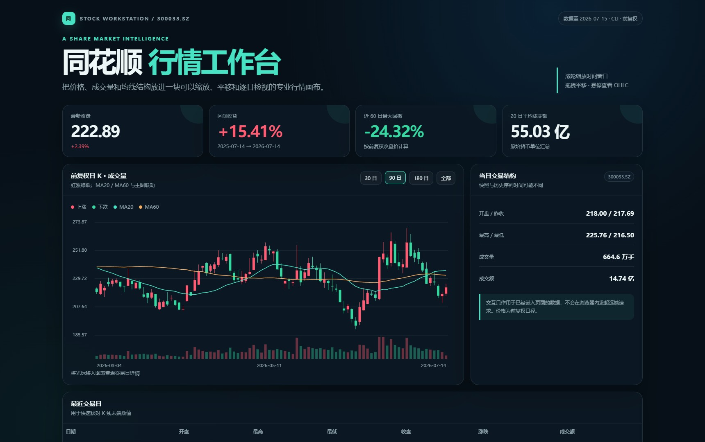</a>
</td>
<td valign="top">

一句话生成单股价格、均线、回撤与成交额联动的交互看板。

<strong>CLI</strong> · <a href="01-stock-overview/README.md">查看完整说明</a> · <a href="01-stock-overview/example.html">打开单文件 HTML</a>

<strong>复制完整 Prompt</strong>

<pre><code>请使用已安装的 `hithink-finance` Skill，为“同花顺”生成一张“单股行情与趋势速览”看板；不假设本地存在任何项目仓库。

### 数据任务

1. 按 Skill 规则复用统一 API Key，优先使用 `hithink-finance` CLI；先查看 `capabilities --format json`，再按需查看 `schema symbol.search`、`schema market.snapshot` 和 `schema market.history`。
2. 用 `symbol search` 将“同花顺”消歧为唯一 A 股 `thscode`，再获取最新行情和最近约 250 个交易日的前复权日 K。
3. 计算区间涨跌幅、MA20/MA60/MA120、近 60 日最大回撤和 20 日平均成交额。原始长序列写入临时文件，不要粘贴到对话。

### 看板产物

- 直接生成当前目录下的 `stock-overview.html` 并在完成后打开预览。
- 必须是可离线打开的单文件 HTML：CSS、图表、数据和 JavaScript 全部内联，不使用 CDN、框架、网络字体或运行时请求。页面应具备现代金融数据产品的专业感和清晰信息层级，具体布局、配色和视觉风格自由发挥。
- 历史数据包含 OHLC 时优先展示 K 线，并联动成交量和均线；支持悬停十字光标与日期价格详情，以及滚轮缩放、拖拽平移、窗口切换或等价的区间探索。交互需兼顾窄屏和键盘操作。
- 标明标的代码、数据时间、前复权口径、数据源和“非投资建议”。不得写入 API Key，不得用模拟数据填补失败项；失败时在页面中如实说明。</code></pre>

</td>
</tr>
</table>

## 2. 单股财务体检

<table>
<tr>
<td width="440" valign="top">
<a href="02-financial-health/example.html">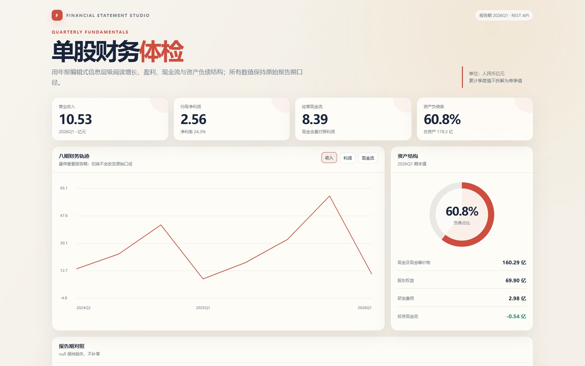</a>
</td>
<td valign="top">

用三张报表和财务指标生成增长、盈利、现金流与杠杆体检页。

<strong>REST API</strong> · <a href="02-financial-health/README.md">查看完整说明</a> · <a href="02-financial-health/example.html">打开单文件 HTML</a>

<strong>复制完整 Prompt</strong>

<pre><code>请使用已安装的 `hithink-finance` Skill，通过 REST API 为“同花顺”生成一张“单股财务体检”看板；不假设本地存在项目仓库、CLI 或 Python SDK。

### 数据任务

1. 按 Skill 的统一凭据规则安全读取 API Key，调用 `GET /api/meta/tickers/search` 将“同花顺”消歧为唯一 A 股 `thscode`；请求头使用 `X-api-key`，不得回显凭据。
2. 分别调用利润表、资产负债表和现金流量表端点，读取最近 8 期 `quarterly` 数据；按 `period_end_ms` 对齐三表，并根据最新报告期调用财务指标端点。
3. 围绕增长、盈利、现金流和杠杆做事实性归纳。`null` 保持缺失，不补零；不要混淆单季值、累计值或不同报告期，也不要编造估值、行业均值和评分。

### 看板产物

- 直接生成当前目录下的 `financial-health.html` 并打开预览。
- 产物必须是无外部依赖、无运行时请求的单文件 HTML，内联 CSS、图表、数据和 JavaScript。页面应具备现代金融数据产品的专业感和清晰信息层级，具体布局、配色和视觉风格自由发挥。
- 展示核心财务数值、同期对比、可切换的收入/利润/现金流序列，以及报告期和字段口径说明；图表支持悬停查看报告期详情，页面需适配手机宽度和键盘操作。
- 标明数据源、报告期、币种和“非投资建议”。原始响应只落到临时目录，不写入 HTML；API Key 不得进入文件、日志或对话。</code></pre>

</td>
</tr>
</table>

## 3. 同花顺概念板块联动

<table>
<tr>
<td width="440" valign="top">
<a href="03-index-constituents/example.html">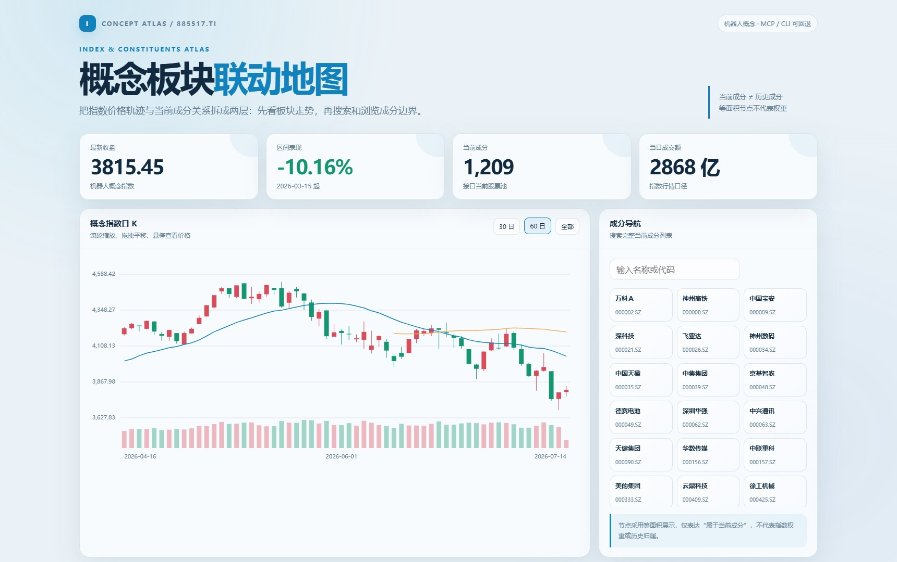</a>
</td>
<td valign="top">

把概念指数走势与当前成分股放在同一页，快速理解板块联动边界。

<strong>MCP（CLI/API 可回退）</strong> · <a href="03-index-constituents/README.md">查看完整说明</a> · <a href="03-index-constituents/example.html">打开单文件 HTML</a>

<strong>复制完整 Prompt</strong>

<pre><code>请使用已安装的 `hithink-finance` Skill，为“机器人概念”生成一张“同花顺概念板块联动”看板；不假设本地存在项目仓库。

### 数据任务

1. 若当前 Agent 已连接托管 MCP，只检查并调用本任务需要的 `hithink-finance-a-share-index` 服务：使用目录工具筛选 `cn_concept`，确认“机器人概念”的唯一 `thscode`，再获取当前成分股和最近约 120 个自然日的指数日线。不要探测无关 MCP 服务。
2. 若 MCP 未连接，使用 Skill 给出的等价 CLI 或 REST 路径完成同一任务；核心功能不得依赖某个特定 Agent 框架。
3. 完整目录和成分股列表落到临时文件，只把页面所需的摘要和有限条目嵌入产物。计算区间涨跌、近 20 日波动和成分数量；指数没有复权概念。

### 看板产物

- 直接生成当前目录下的 `index-constituents.html` 并打开预览。
- 必须是无外部依赖的单文件 HTML，内联 CSS、图表、数据和 JavaScript。页面应具备现代金融数据产品的专业感和清晰信息层级，具体布局、配色和视觉风格自由发挥。
- 指数历史包含 OHLC 时可展示支持悬停详情、缩放和平移的 K 线或其他合适图表；同时提供指数窗口切换和成分股名称/代码搜索，并适配窄屏和键盘操作。
- 指数走势与成分关系分开展示，明确“当前成分不代表历史成分，指数涨跌也不证明单只股票的概念相关度”。
- 标明指数代码、数据日期、接入方式、数据源和“非投资建议”；不得使用模拟数据或泄露 API Key。</code></pre>

</td>
</tr>
</table>

## 4. 涨停池与连板天梯

<table>
<tr>
<td width="440" valign="top">
<a href="04-limit-up-market/example.html">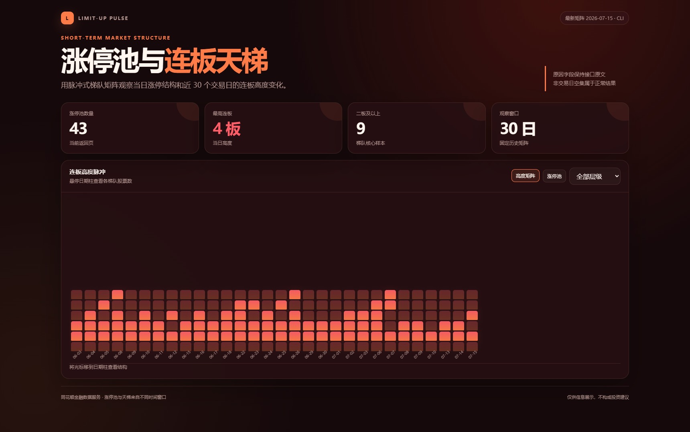</a>
</td>
<td valign="top">

用当前涨停结构与 30 日连板矩阵生成短线市场结构看板。

<strong>CLI</strong> · <a href="04-limit-up-market/README.md">查看完整说明</a> · <a href="04-limit-up-market/example.html">打开单文件 HTML</a>

<strong>复制完整 Prompt</strong>

<pre><code>请使用已安装的 `hithink-finance` Skill，生成一张“涨停池与连板天梯”看板；不假设本地存在项目仓库。

### 数据任务

1. 优先使用 `hithink-finance` CLI。先检查 capabilities，并按需读取 `schema special.limit-up-pool` 与 `schema special.limit-up-ladder`。
2. 获取最新可用涨停池，按连板天数降序、合理页大小取数；再获取接口固定的近 30 个交易日连板天梯。完整结果写入临时文件，不在对话中展开。
3. 统计涨停数量、最高连板、各连板层级数量、封单额较高的代表股票，以及近 30 日最高板高度变化。原因字段只使用接口返回值，不自行扩写。

### 看板产物

- 直接生成当前目录下的 `limit-up-market.html` 并打开预览。
- 必须是无外部依赖的单文件 HTML，内联 CSS、图表、数据和 JavaScript。页面应具备现代金融数据产品的专业感和清晰信息层级，具体布局、配色和视觉风格自由发挥。
- 支持“今日涨停池/30 日天梯”切换与连板层级筛选；天梯或矩阵可悬停查看交易日和梯队详情，列表可快速浏览涨停原因，并适配窄屏和键盘操作。
- 明确涨停池与天梯的时间范围不同，非交易日空集属于正常结果。
- 标明最新可用交易日、数据源和“非投资建议”；不得使用模拟数据、交易指令或泄露凭据。</code></pre>

</td>
</tr>
</table>

## 5. 自选股当日异动监控

<table>
<tr>
<td width="440" valign="top">
<a href="05-watchlist-anomalies/example.html">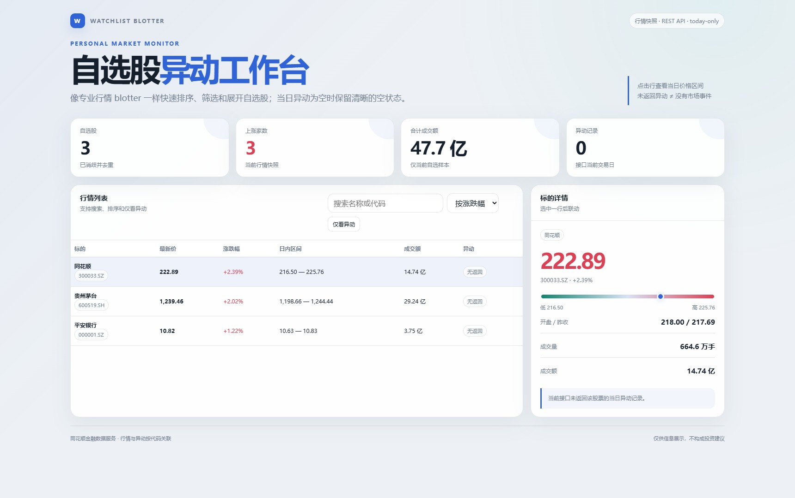</a>
</td>
<td valign="top">

把自选股快照与今日异动原因组合成可排序、可筛选的轻量监控页。

<strong>REST API</strong> · <a href="05-watchlist-anomalies/README.md">查看完整说明</a> · <a href="05-watchlist-anomalies/example.html">打开单文件 HTML</a>

<strong>复制完整 Prompt</strong>

<pre><code>请使用已安装的 `hithink-finance` Skill，通过 REST API 为“同花顺、贵州茅台、平安银行”生成一张“自选股当日异动监控”看板；不假设本地存在项目仓库。

### 数据任务

1. 按统一凭据规则读取 API Key，使用 `GET /api/meta/tickers/search` 逐一消歧并去重，最多保留 20 只 A 股；不得猜交易所后缀。
2. 用 `GET /api/a-share/prices/snapshot` 批量获取行情，再用 `GET /api/a-share/special-data/anomaly-analysis-stock` 查询这些代码的当日异动原因。检查 HTTP 状态和业务信封 `code=0`。
3. 按代码关联行情与异动记录。未返回异动只表示当前接口没有匹配记录，不能解释为股票没有任何市场事件。

### 看板产物

- 直接生成当前目录下的 `watchlist-anomalies.html` 并打开预览。
- 必须是无外部依赖、无运行时请求的单文件 HTML。页面应具备现代金融数据产品的专业感和清晰信息层级，具体布局、配色和视觉风格自由发挥。
- 支持按涨跌幅/成交额排序、搜索以及“仅看有异动”筛选；展示最新价、涨跌幅、日内区间、成交额和接口原因，点击标的可联动详情，空异动状态也要清晰可读。
- 标明行情时间、today-only 边界、数据源和“非投资建议”。不得把 API Key 或完整原始响应写入产物。</code></pre>

</td>
</tr>
</table>

## 6. 本地全市场趋势研究（进阶）

<table>
<tr>
<td width="440" valign="top">
<a href="06-marketdb-research/example.html">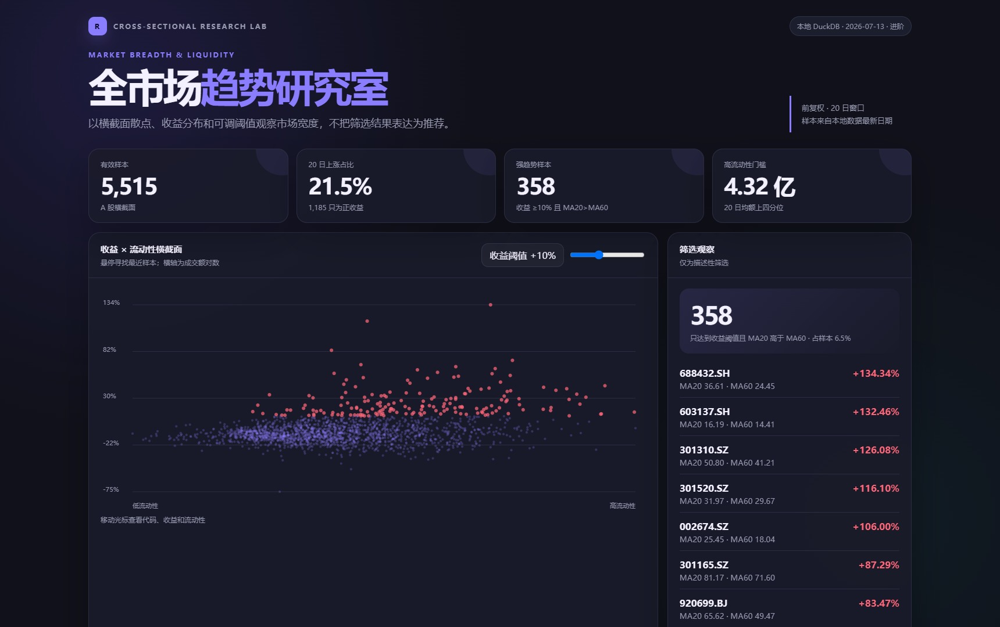</a>
</td>
<td valign="top">

用本地 DuckDB 面板生成市场宽度、趋势结构与流动性分层看板。

<strong>CLI · 本地 DuckDB</strong> · <a href="06-marketdb-research/README.md">查看完整说明</a> · <a href="06-marketdb-research/example.html">打开单文件 HTML</a>

<strong>复制完整 Prompt</strong>

<pre><code>请使用已安装的 `hithink-finance` Skill，生成一张“本地全市场趋势研究”看板；不假设本地存在项目仓库或 Python SDK。这是进阶任务。

### 数据任务

1. 优先使用 `hithink-finance` CLI，先运行 `data status` 与 `db describe`，确认本地 DuckDB 路径、schema 和最新交易日。若数据库不存在，不要静默发起全市场远端逐股请求；说明 `data init` 是长任务并在获得确认后再初始化。
2. 数据库可用时，用 `market panel --output` 将最近约 80 个交易日的前复权全市场面板导出到临时 Parquet；或用只读 SQL/`db export` 直接生成每只股票的 20 日涨跌幅、MA20/MA60、20 日平均成交额等横截面指标。
3. 汇总市场上涨占比、强趋势数量、流动性分层和代表股票。全市场明细只落盘，不能写入对话；筛选结果不得表述为推荐。

### 看板产物

- 直接生成当前目录下的 `marketdb-research.html` 并打开预览。
- 必须是无外部依赖的单文件 HTML，内联 CSS、图表、压缩后的必要摘要和 JavaScript。页面应具备现代金融数据产品的专业感和清晰信息层级，具体布局、配色和视觉风格自由发挥。
- 使用散点、分布、热力图或其他适合横截面的可视化，支持悬停查看样本详情，并提供 20 日涨幅阈值、流动性或等价的联动筛选；适配窄屏和键盘操作。
- 展示数据库最新日期、样本数、窗口、筛选规则和前复权口径，并明确本地数据新鲜度。
- 标明本地数据源和“非投资建议”；不得嵌入全市场原始明细、数据库文件或任何凭据。</code></pre>

</td>
</tr>
</table>

## 7. 市场热度与飙升雷达

<table>
<tr>
<td width="440" valign="top">

</td>
<td valign="top">

联动热股榜、飙升榜与排名趋势，观察关注度的层次和变化。

<strong>CLI</strong> · <a href="07-market-heat-radar/README.md">查看完整说明</a> · <a href="07-market-heat-radar/example.html">打开单文件 HTML</a>

<strong>复制完整 Prompt</strong>

<pre><code>请使用已安装的 `hithink-finance` Skill，生成一张“市场热度与飙升雷达”看板；不假设本地存在项目仓库。

### 数据任务

1. 优先使用 `hithink-finance` CLI，检查 capabilities，并按需读取 `schema special.hot-stock`、`schema special.skyrocket` 和 `schema special.hot-stock-trend`。
2. 分别获取热股榜与飙升榜的 `day`、`hour` 数据；对热股榜前 3 名再查询近 30 日排名趋势。榜单完整响应落到临时文件。
3. 比较榜单重合度、热度、排名变化和趋势方向。热股榜与飙升榜含义不同，不要混成单一评分，也不要把排名变化解释成确定性买卖信号。

### 看板产物

- 直接生成当前目录下的 `market-heat-radar.html` 并打开预览。
- 必须是无外部依赖、无运行时请求的单文件 HTML。页面应具备现代金融数据产品的专业感和清晰信息层级，具体布局、配色和视觉风格自由发挥。
- 支持热股/飙升与 24 小时/小时四种视图切换，并展示代表股票的近 30 日排名轨迹；排名图支持悬停详情和区间探索，排名、热度与趋势方向在窄屏下仍清晰可操作。
- 标明榜单时间、统计周期、数据源、数据延迟边界和“非投资建议”；不得使用模拟数据或泄露凭据。</code></pre>

</td>
</tr>
</table>

## 8. 龙虎榜机构与游资观察

<table>
<tr>
<td width="440" valign="top">
<a href="08-dragon-tiger-watch/example.html">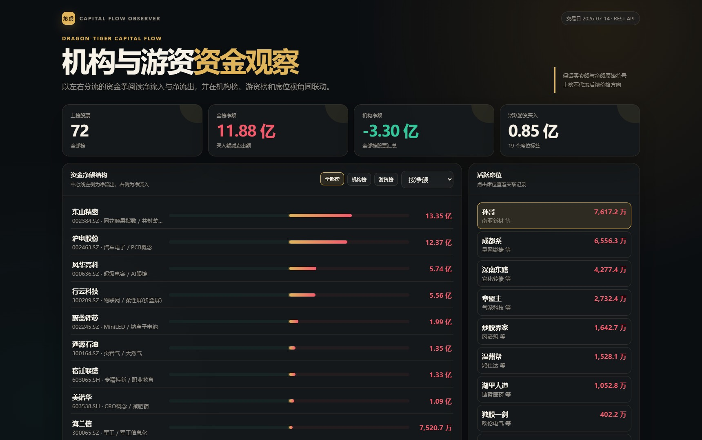</a>
</td>
<td valign="top">

用全部榜、机构榜与游资榜观察净额结构和活跃席位。

<strong>REST API</strong> · <a href="08-dragon-tiger-watch/README.md">查看完整说明</a> · <a href="08-dragon-tiger-watch/example.html">打开单文件 HTML</a>

<strong>复制完整 Prompt</strong>

<pre><code>请使用已安装的 `hithink-finance` Skill，通过 REST API 生成一张“龙虎榜机构与游资观察”看板；不假设本地存在项目仓库。

### 数据任务

1. 按 Skill 的统一凭据规则安全读取 API Key，调用 `GET /api/a-share/special-data/dragon-tiger-list`，分别获取 `board_type=all`、`org` 和 `hot_money` 的最新可用交易日数据；不得假设省略日期就一定是今天。
2. 检查 HTTP 状态与业务信封 `code=0`。按 `trade_date` 对齐三类结果，完整响应只写入临时文件。
3. 汇总股票数量、买卖总额、净额、机构净额、游资净额和活跃游资席位；保留正负号与原始口径，不把上榜或净买入扩写成推荐。

### 看板产物

- 直接生成当前目录下的 `dragon-tiger-watch.html` 并打开预览。
- 必须是无外部依赖、无运行时请求的单文件 HTML。页面应具备现代金融数据产品的专业感和清晰信息层级，具体布局、配色和视觉风格自由发挥。
- 支持全部榜/机构榜/游资榜切换，并可按净额、机构净额或游资净额排序；使用双向金额条或其他合适图形表达流入流出，点击股票或席位可联动有限数量的代表记录，并适配窄屏和键盘操作。
- 标明实际交易日、数据源、榜单口径和“非投资建议”；不得写入 API Key、完整原始响应或交易指令。</code></pre>

</td>
</tr>
</table>
## 9. 行业强度作战矩阵

<table><tr><td width="440" valign="top"><a href="09-industry-strength-rotation/example.html">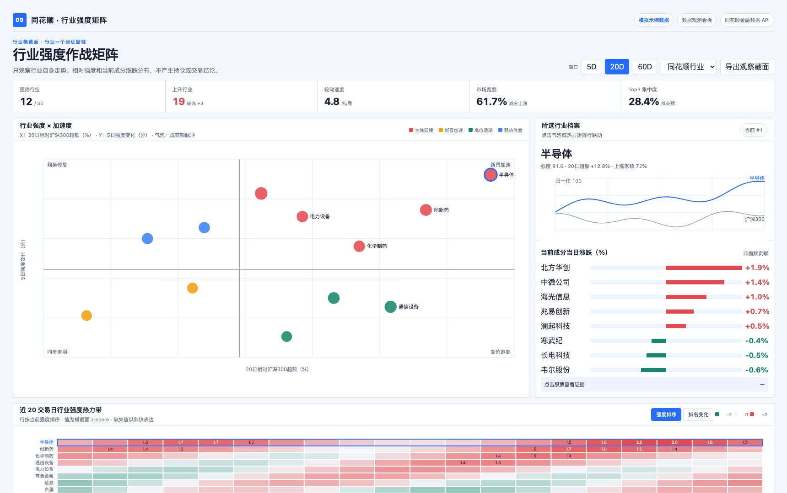</a></td><td valign="top">
行业横截面强度、加速度与当前成分涨跌分布联动观察。

<strong>REST API · 行业指数</strong> · <a href="09-industry-strength-rotation/README.md">查看完整说明</a> · <a href="09-industry-strength-rotation/example.html">打开单文件 HTML</a>

<strong>复制完整 Prompt</strong>
<pre><code>请使用已安装的 `hithink-finance` Skill，生成一张"行业强度作战矩阵"数据观测看板。所有真实金融数据只能来自同花顺金融数据 API

### 数据任务

1. 读取同花顺行业指数目录和历史日 K，计算 5/20/60 日相对强度、成交额脉冲、排名变化与市场宽度。
2. 用户选择行业时，再读取该行业当前成分和股票快照，计算上涨/下跌家数、等权涨跌代理与成交额活跃度。
3. 生成行业强度气泡、近20日热力带和行业—个股联动证据；不得把当前成分的等权涨跌代理称为指数贡献。

### 页面产物

- 生成可离线打开的单文件 HTML，所有 CSS、图表、示例数据和 JavaScript 内联。
- 页面必须显著标注数据时间、模拟/真实模式、来源 endpoint、计算口径和"非投资建议"。
- 不得把 API Key 写入浏览器；真实取数由本地服务读取环境变量中的 API Key。
- 页面定位为数据观察与视觉穿透，不添加组合评价或交易执行模块。</code></pre>
</td></tr></table>

## 10. 现金流质量稽核台

<table><tr><td width="440" valign="top"><a href="10-cashflow-quality/example.html">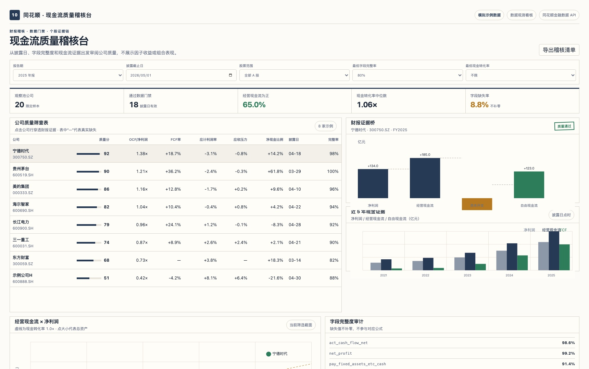</a></td><td valign="top">
按披露日审阅现金转化、自由现金流、应计与字段完整度。

<strong>REST API · 财务报表</strong> · <a href="10-cashflow-quality/README.md">查看完整说明</a> · <a href="10-cashflow-quality/example.html">打开单文件 HTML</a>

<strong>复制完整 Prompt</strong>
<pre><code>请使用已安装的 `hithink-finance` Skill，生成一张"现金流质量稽核台"数据观测看板。所有真实金融数据只能来自同花顺金融数据 API

### 数据任务

1. 使用代码表明确限定最多 20 只股票的观察池；财务报表端点均为单只股票请求，不把代码表误当成批量财务接口。调用三张报表时传 `period=annual&limit=5`，按 `period_end_ms` 对齐报告期，并以 `report_date_ms` 控制披露时点。
2. 仅使用已提供字段计算：现金转化率=`act_cash_flow_net/net_profit`，自由现金流率=`(act_cash_flow_net-pay_fixed_assets_etc_cash)/operating_income`，应计利润率=`(net_profit-act_cash_flow_net)/assets_total`，应收压力=`accounts_receivable/operating_income`，净现金比例=`(cash-total_debt)/assets_total`；分母为0或缺失时留空。
3. 生成公司筛查表、利润—经营现金流桥、5年现金证据和字段完整度审计。

### 页面产物

- 生成可离线打开的单文件 HTML，所有 CSS、图表、示例数据和 JavaScript 内联。
- 页面必须显著标注数据时间、模拟/真实模式、来源 endpoint、计算口径和"非投资建议"。
- 不得把 API Key 写入浏览器；真实取数由本地服务读取环境变量中的 API Key。
- 页面定位为数据观察与视觉穿透，不添加组合评价或交易执行模块。</code></pre>
</td></tr></table>

## 11. 热榜—股价关系观察台

<table><tr><td width="440" valign="top"><a href="11-attention-price-resonance/example.html">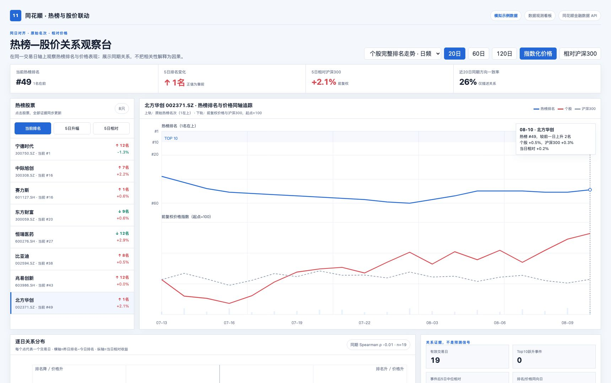</a></td><td valign="top">
在同一交易日轴上观察热榜原始名次与股价、沪深300的同期关系。

<strong>REST API · 历史热榜</strong> · <a href="11-attention-price-resonance/README.md">查看完整说明</a> · <a href="11-attention-price-resonance/example.html">打开单文件 HTML</a>

<strong>复制完整 Prompt</strong>
<pre><code>请使用已安装的 `hithink-finance` Skill，生成一张"热榜—股价关系观察台"数据观测看板。所有真实金融数据只能来自同花顺金融数据 API

### 数据任务

1. 将个股热榜排名、股票前复权日 K 与沪深300按同一交易日历对齐。
2. 默认展示所选股票的排名—价格双轨，排名纵轴反转并保留原始名次；下轨展示股票与基准的指数化价格。
3. 用逐日散点展示"昨日排名－今日排名"与当日相对收益，显示同期 Spearman 相关、样本数和跃升事件。
4. 明确 Top30 历史榜与个股完整排名走势的差异；日榜不与小时榜价格混用。

### 页面产物

- 生成可离线打开的单文件 HTML，所有 CSS、图表、示例数据和 JavaScript 内联。
- 页面必须显著标注数据时间、模拟/真实模式、来源 endpoint、计算口径和"非投资建议"。
- 不得把 API Key 写入浏览器；真实取数由本地服务读取环境变量中的 API Key。
- 页面定位为数据观察与视觉穿透，不添加组合评价或交易执行模块。</code></pre>
</td></tr></table>

## 12. 涨停情绪市场脉冲屏

<table><tr><td width="440" valign="top"><a href="12-limitup-sentiment-timing/example.html">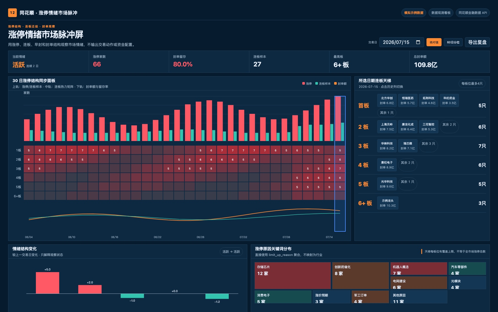</a></td><td valign="top">
同步观察涨停、连板梯队、封单留存和涨停原因分布。

<strong>REST API · 涨停数据</strong> · <a href="12-limitup-sentiment-timing/README.md">查看完整说明</a> · <a href="12-limitup-sentiment-timing/example.html">打开单文件 HTML</a>

<strong>复制完整 Prompt</strong>
<pre><code>请使用已安装的 `hithink-finance` Skill，生成一张"涨停情绪市场脉冲屏"数据观测看板。所有真实金融数据只能来自同花顺金融数据 API

### 数据任务

1. 从涨停池的 `pagination.total`、`continue_day_cnt`、`limit_up_time`、`seal_money` 和 `max_seal_money` 计算涨停数、连板数、最高板、早封率和封单留存；接口不提供炸板池，不得生成炸板数量。
2. 使用近30日连板天梯绘制板位×日期矩阵；晋级率只能在天梯返回的有限样本内按股票代码匹配估算，并标明不是全市场晋级率。
3. 联动连板层级变化、封单结构和 `limit_up_reason` 原因分布；接口不提供行业字段，不得把涨停原因改写成行业分布。

### 页面产物

- 生成可离线打开的单文件 HTML，所有 CSS、图表、示例数据和 JavaScript 内联。
- 页面必须显著标注数据时间、模拟/真实模式、来源 endpoint、计算口径和"非投资建议"。
- 不得把 API Key 写入浏览器；真实取数由本地服务读取环境变量中的 API Key。
- 页面定位为数据观察与视觉穿透，不添加组合评价或交易执行模块。</code></pre>
</td></tr></table>

## 13. 价格成交量突破回测台

<table><tr><td width="440" valign="top"><a href="13-price-volume-breakout/example.html">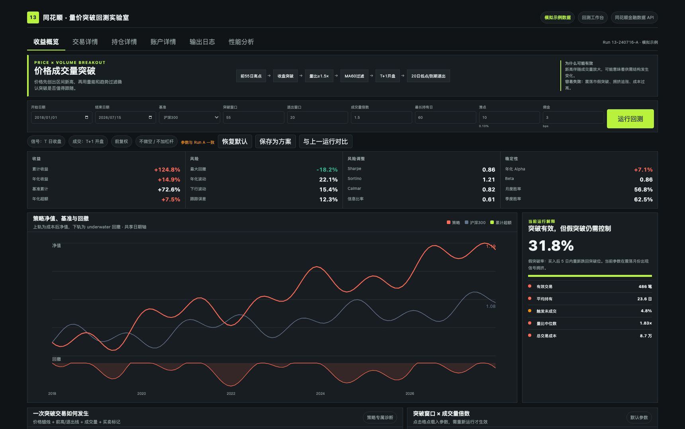</a></td><td valign="top">
解释突破如何形成、如何成交、为何退出，并完整评估表现。

<strong>Parquet · 日 K 回测</strong> · <a href="13-price-volume-breakout/README.md">查看完整说明</a> · <a href="13-price-volume-breakout/example.html">打开单文件 HTML</a>

<strong>复制完整 Prompt</strong>
<pre><code>请使用已安装的 `hithink-finance` Skill，生成一张"价格成交量突破回测台"回测工作台。所有真实金融数据只能来自同花顺金融数据 API

### 数据任务

1. 通过平台登录态获取全市场日 K 与复权事件 dump 的短时效下载链接，下载后按主键去重，并用复权事件构造一致的回测价格序列；沪深300基准通过指数历史 K 线端点获取。
2. 构造前55日高点（排除当天）、20日退出低点、量比和MA60过滤。
3. T日收盘产生信号，T+1开盘按用户给定的滑点和费用假设成交；日 K 只能近似涨跌停成交约束，不能声称掌握盘口成交。
4. 输出净值、回撤、完整指标、逐笔交易、假突破、事件K线和参数敏感性。

### 页面产物

- 生成可离线打开的单文件 HTML，所有 CSS、图表、示例数据和 JavaScript 内联。
- 页面必须显著标注数据时间、模拟/真实模式、来源 endpoint、计算口径和"非投资建议"。
- 不得把 API Key 写入浏览器；真实取数由本地服务读取环境变量中的 API Key。
- 参数修改需显示未应用状态；运行后输出收益、风险、风险调整、稳定性、交易成本和策略专属诊断。</code></pre>
</td></tr></table>

## 14. 时间序列动量回测台

<table><tr><td width="440" valign="top"><a href="14-time-series-momentum/example.html">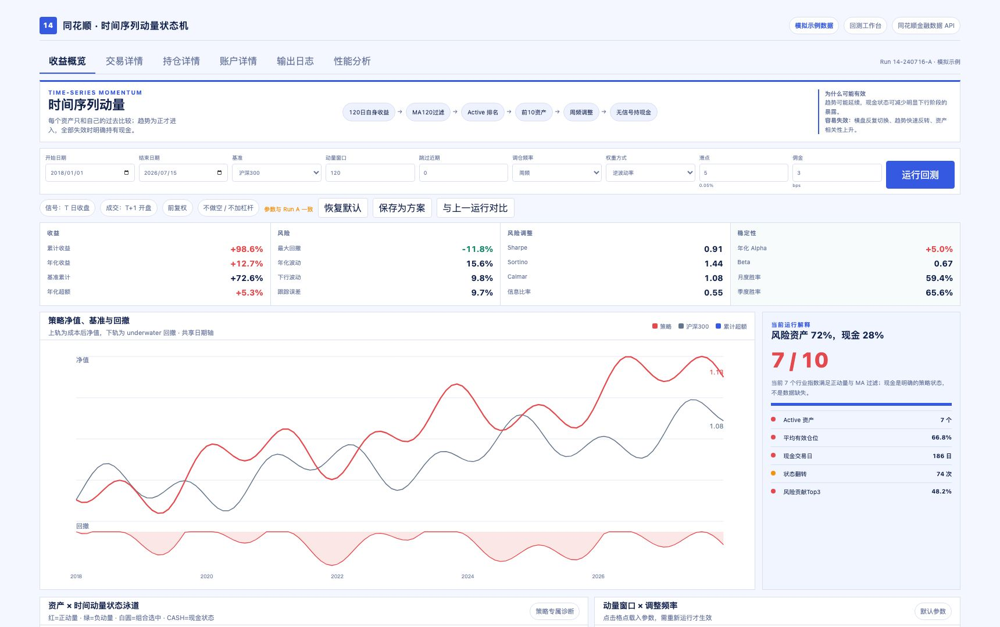</a></td><td valign="top">
把资产 Active/Inactive、现金状态与组合表现放进同一状态机。

<strong>REST API · 指数日 K</strong> · <a href="14-time-series-momentum/README.md">查看完整说明</a> · <a href="14-time-series-momentum/example.html">打开单文件 HTML</a>

<strong>复制完整 Prompt</strong>
<pre><code>请使用已安装的 `hithink-finance` Skill，生成一张"时间序列动量回测台"回测工作台。所有真实金融数据只能来自同花顺金融数据 API

### 数据任务

1. 通过同花顺指数目录或指数代码表确定一个明确资产池；逐个调用指数历史 K 线端点，使用相同交易日区间和 `interval=1d` 对齐 OHLC 数据。
2. 计算120日自身动量、MA120状态和60日波动率；周频/月频信号由日 K 在本地重采样，支持等权/逆波动率。
3. T日收盘计算状态，T+1开盘执行；无Active资产时现金比例为100%。
4. 输出净值回撤、完整绩效、状态泳道、风险贡献和窗口敏感性。

### 页面产物

- 生成可离线打开的单文件 HTML，所有 CSS、图表、示例数据和 JavaScript 内联。
- 页面必须显著标注数据时间、模拟/真实模式、来源 endpoint、计算口径和"非投资建议"。
- 不得把 API Key 写入浏览器；真实取数由本地服务读取环境变量中的 API Key。
- 参数修改需显示未应用状态；运行后输出收益、风险、风险调整、稳定性、交易成本和策略专属诊断。</code></pre>
</td></tr></table>

## 15. 短期反转回测实验室

<table><tr><td width="440" valign="top"><a href="15-short-term-reversal/example.html">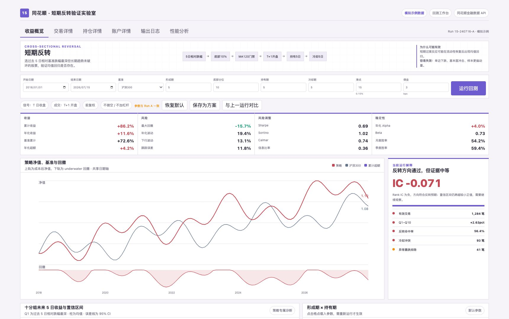</a></td><td valign="top">
用分组、Rank IC、市场状态和成本检验短期反转证据。

<strong>Parquet · 横截面回测</strong> · <a href="15-short-term-reversal/README.md">查看完整说明</a> · <a href="15-short-term-reversal/example.html">打开单文件 HTML</a>

<strong>复制完整 Prompt</strong>
<pre><code>请使用已安装的 `hithink-finance` Skill，生成一张"短期反转回测实验室"回测工作台。所有真实金融数据只能来自同花顺金融数据 API

### 数据任务

1. 通过平台登录态获取全市场日 K 与复权事件 dump 的短时效下载链接，构造复权后的全市场面板；通过指数历史 K 线端点获取沪深300基准，并按交易日内连接。
2. 计算过去5日相对基准收益，过滤流动性、MA120与异常单日跌幅，选择底部10%。
3. T日收盘选股，T+1开盘买入，固定持有5日并执行5日冷却；费用和滑点为用户给定假设。
4. 输出净值回撤、完整绩效、十分组、Rank IC、市场状态与形成期×持有期敏感性。

### 页面产物

- 生成可离线打开的单文件 HTML，所有 CSS、图表、示例数据和 JavaScript 内联。
- 页面必须显著标注数据时间、模拟/真实模式、来源 endpoint、计算口径和"非投资建议"。
- 不得把 API Key 写入浏览器；真实取数由本地服务读取环境变量中的 API Key。
- 参数修改需显示未应用状态；运行后输出收益、风险、风险调整、稳定性、交易成本和策略专属诊断。</code></pre>
</td></tr></table>

## 16. 龙虎榜资金流向拓扑台

<table><tr><td width="440" valign="top"><a href="16-dragon-tiger-capital-flow/example.html">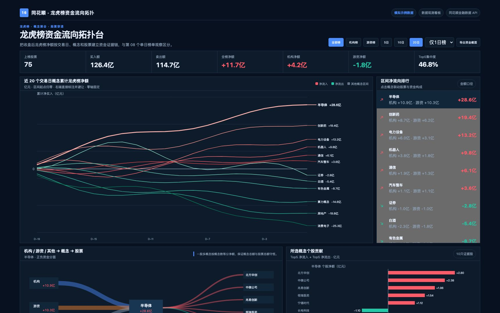</a></td><td valign="top">
把跨交易日龙虎榜净额聚合为概念轨迹，并穿透到机构、游资和股票。

<strong>REST API · 龙虎榜</strong> · <a href="16-dragon-tiger-capital-flow/README.md">查看完整说明</a> · <a href="16-dragon-tiger-capital-flow/example.html">打开单文件 HTML</a>

<strong>复制完整 Prompt</strong>
<pre><code>请使用已安装的 `hithink-finance` Skill，生成一张"龙虎榜资金流向拓扑台"数据观测看板。所有真实金融数据只能来自同花顺金融数据 API

### 数据任务

1. 先调用 `GET /api/a-share/calendar/trading-days` 取得近一年交易日，再逐日调用龙虎榜端点读取全部榜、机构榜或游资榜；默认只纳入 `range_days=1`，避免1日榜与3日榜重复。
2. 一只股票有多个概念时按概念数等分净额，保证概念聚合总额守恒。
3. 生成概念累计净额轨迹、端点防碰撞标签、资金路径和股票正负贡献联动。

### 页面产物

- 生成可离线打开的单文件 HTML，所有 CSS、图表、示例数据和 JavaScript 内联。
- 页面必须显著标注数据时间、模拟/真实模式、来源 endpoint、计算口径和"非投资建议"。
- 不得把 API Key 写入浏览器；真实取数由本地服务读取环境变量中的 API Key。
- 页面定位为数据观察与视觉穿透，不添加组合评价或交易执行模块。</code></pre>
</td></tr></table>

<!-- INSPIRATIONS:END -->
