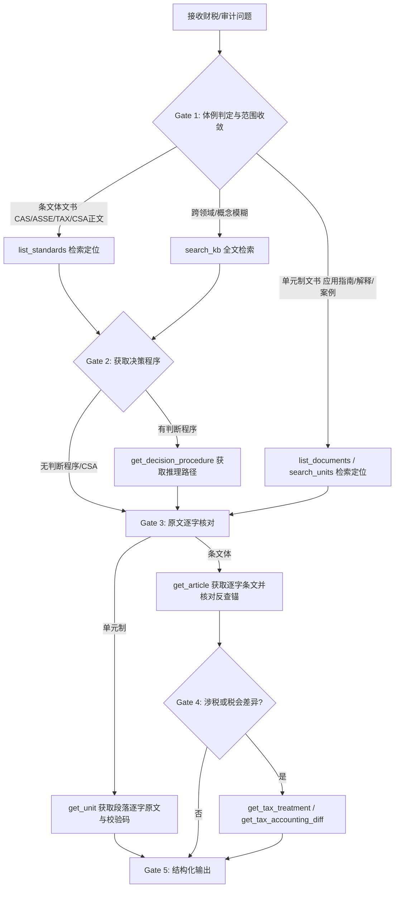

# 账面 Quaesto (dsh-plugin-cas-kb) — 中国会计准则、税法与审计准则知识库

本技能直连 [账面 Quaesto 开放知识库](https://open.accountingllm.site)，覆盖 265 篇可寻址文书：
- **条文层**（53 篇 / 1,832 条原文）：企业会计准则（CAS 43 篇）、小企业会计准则（ASSE）及划型标准规定、税法（TAX 8 部法律与实施条例）；其中 50 篇带逐步挂条款锚的判断决策程序（1,681 步）。
- **单元层**（212 篇 / 10,013 个可引用单元）：注册会计师审计准则（CSA）、应用指南与职业道德守则（103 篇 / 7,672 单元），以及准则解释、应用案例、官方解读、监管指引与年报通知。

> 📖 **阅读文档指引**：
> 在执行具体财税审计业务或需要深入了解完整参数与实测背景前，请先 `view_file` 阅读项目根目录下的 [README.zh.md](./README.zh.md) 与 [README.md](./README.md)。

---

## ⚠️ 核心法则 (Golden Rules)

1. **给不出逐字出处，就说库里没有**：严禁凭记忆编造条款或把“实务共识”写成准则原话（例如“捐赠支出全额计入营业外支出”是常见处理而非准则条文，不许挂条款锚）。
2. **严禁给单元制文书编条号**：审计准则应用指南、准则解释、官方解读、应用案例等没有「第 X 条」体例，写成「《X 应用指南》第 5 条」即为伪造引用。引用必须使用 `stable_id` 与段标题（如 `csa-1111-ag.2.2.13`）。
3. **分清原文层与判断层的证据效力**：原文层（条文与单元）是官方发布的转录副本，可作为法规依据引用；判断决策程序（OKF）是 AI 辅助研究草案（未经 CPA 逐条核定），仅供决策逻辑参考。
4. **企业规模由函数推导，严禁主观声明**：判定企业适用准则时，必须调用 `check_applicability` 传入 `(industry, revenue_wan, employees, assets_wan)` 计算，不得自行先入为主判定“这是小微企业”。
5. **税法公告层（L3）依赖提示**：若返回带有 `l3_dependency: true`，说明现行执行口径受财税规范性文件或税务总局最新公告调整，必须显式提醒用户核对最新公告。
6. **查证用于核对，而非盲目改写初判**：先按专业理解得出初判再查证。查回条文只有明确与初判存在字面矛盾时才改口，且必须明确指出矛盾在具体哪一句原文。

---

## ⚙️ 轨迹驱动执行引擎 (Execution Trajectory)

遇到任何涉及中国大陆会计科目、计量判断、准则适用、增值税/所得税口径、税会差异或 CPA 审计实务问题时，按以下状态机执行：

### Gate 1: 体例判定与范围收敛
- **条文体**（CAS 准则 / ASSE 小准则 / TAX 税法 / CSA 审计正文）：调用 `list_standards(framework=...)`。
- **单元制**（审计准则应用指南 / 会计准则解释 / 应用案例 / 监管指引）：调用 `list_documents(framework=...)` 或 `search_units(q=...)`。
- **全局检索**：调用 `search_kb(q=..., scope=...)`。

### Gate 2: 决策程序获取 (Decision Procedure)
- 对 CAS / ASSE / TAX 文书，调用 `get_decision_procedure(ref=...)`（如 `ref="CAS 14"` 或 `ref="增值税法"`），获取逐步判据及挂载的条款锚。

### Gate 3: 原文逐字核对 (Verbatim Verification)
- **条文体**：调用 `get_article(ref=..., article_no=...)`，取得该条正文及引用该条的所有判断步骤。
- **单元制**：调用 `get_unit(stable_id=...)`，取得该段正文、来源文号及 SHA-256 校验值。
- **核对规则**：结论中出现的每一个条号和 `stable_id` 都必须来自工具真实返回，严禁凭预训练记忆输出。

### Gate 4: 涉税与税会差异处理 (Tax & Diff)
- 扣除标准/税率/小微优惠：调用 `get_tax_treatment(category=..., id=...)`。
- 税会差异（以 CAS 18 为核心）：调用 `get_tax_accounting_diff(difference_type=..., cas18_step=...)`。

### Gate 5: 结构化输出 (Structured Response)
- 先结论，后依据；依据写成《准则名》第 N 条或《指南名》段标题，附带原文关键句。
- 会计与税法口径不一致时，明确区分并标注差异属性（永久性 / 暂时性差异）。
- 库内无记录时明确提示缺口，不凭空推演。

---

## 🛠️ 工具与接口速查 (Tools & Endpoints)

知识库提供 REST API（基址：`https://api.accountingllm.site`）与 MCP 工具（免 API Key、免注册）：

| MCP 工具名 / REST 路径 | 功能用途 | 关键参数 |
|---|---|---|
| `list_standards` `GET /v1/standards` | 查询条文体文书索引及触发判据 | `framework`: CAS / ASSE / TAX / CSA |
| `get_decision_procedure` `GET /v1/standards/{key}` | 获取判断决策程序（逐步判据+法条锚） | `ref`: 准则简称或全称 |
| `get_article` `GET /v1/standards/{key}/articles` | 获取条文逐字原文与反查映射 | `ref`, `article_no` |
| `search_kb` `GET /v1/search` | 全文检索（原文+步骤+单元） | `q`, `scope`: all/article/okf_step/unit |
| `check_applicability` `GET /v1/applicability` | 企业主体画像计算准则适用性 | `industry`, `revenue_wan`, `employees`, `assets_wan` |
| `get_tax_treatment` `GET /v1/tax/l1` | 查所得税扣除/增值税率/优惠口径 | `category`, `id` |
| `get_tax_accounting_diff` `GET /v1/tax/diff` | 查税会差异与 CAS 18 步骤映射 | `difference_type`, `cas18_step` |
| `list_documents` `GET /v1/documents` | 查询单元制文书（指南/解释/案例）索引 | `framework`: CAS / CSA |
| `search_units` `GET /v1/search` | 单元制文书检索，返回 `stable_id` | `q`, `limit` |
| `get_unit` `GET /v1/units/{stable_id}` | 按 `stable_id` 获取单元逐字正文及哈希 | `stable_id` (如 `csa-1141-ag.1.1.1`) |

---

## 🚨 异常处理与降级模式 (Troubleshooting & Degradation)

- **网络/服务不可达**：若 MCP 工具或 API 响应超时或报错 429（限流），提示稍后重试，并明确告知用户当前结论基于模型通用记忆生成，未通过官方转录库逐字核验。
- **条文未命中 (404/Not Found)**：严禁猜测条文，直接说明：“在官方会计/税法库中未检索到该条款，可能属于未收录的财税通知（L3 公告层）或地方性规程”。
- **企业划型参数缺失**：若用户未提供完整四要素，`check_applicability` 将返回 `missing_inputs`，必须向用户追问缺失的指标（如年营业收入、从业人数或资产总额）。
