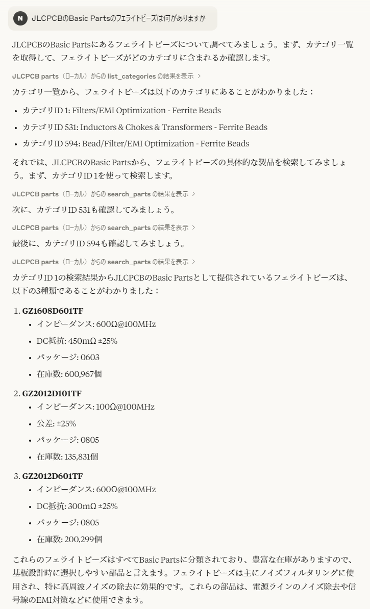

# JLCPCB Parts MCP Server

## 偙傟偼壗

JLCPCB偺PCBA岦偗偺丄晹昳扵偟傪曗彆偡傞MCP僒乕僶乕偱偡丅

## 夛榖椺

Basic Parts偵暘椶偝傟偰偄傞丄僼僃儔僀僩價乕僘傪専嶕偟偨椺偱偡丅


傑偨丄埲壓偺儁乕僕偱偼崀埑宆DC-DC僐儞僶乕僞偺掞峈抣偺慖掕傪峴偭偰偄傑偡丅
https://claude.ai/share/9f02f1a4-7b38-48fb-b29a-f10cf1e608ba

## 愝掕

僨乕僞儀乕僗偲偟偰丄[JLC PCB SMD Assembly Component Catalogue](https://github.com/yaqwsx/jlcparts)傪巊梡偟偰偄傑偡丅
偙偙偱暘妱ZIP偵偟偰採嫙偝傟偰偄傞 `cache.sqlite3` 偑昁梫偱偡丅2025擭4寧尰嵼丄斣崋偼 `cache.z19` 傑偱懚嵼偟傑偡丅

Python偱MCP偑棙梡壜擻側娐嫬傪嶌傝丄僒乕僶乕偲偟偰 `server.py` 傪巜掕偟偰偔偩偝偄丅
傑偨丄僨乕僞儀乕僗傊偺僷僗傪 `JLCPCB_DB_PATH` 娐嫬曄悢傊愝掕偡傞昁梫偑偁傝傑偡丅

Claude Desktop偱偺愝掕椺傪埲壓偵帵偟傑偡丅

```json
{
  "mcpServers": {
    "JLCPCB parts": {
      "command": "python",
      "args": [
        "path/to/server.py"
      ],
      "env": {
        "JLCPCB_DB_PATH": "path/to/database.sqlite3"
      }
    }
  }
}
```
