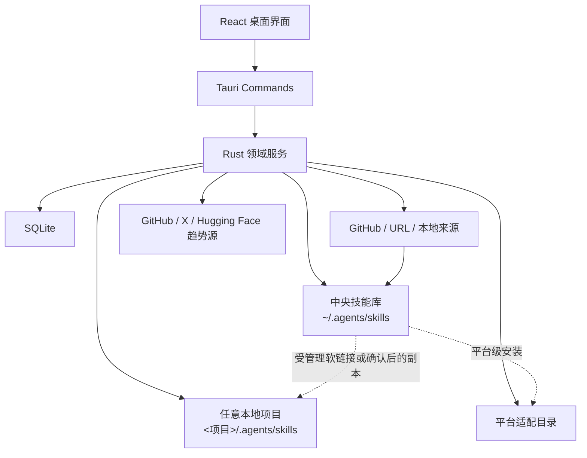
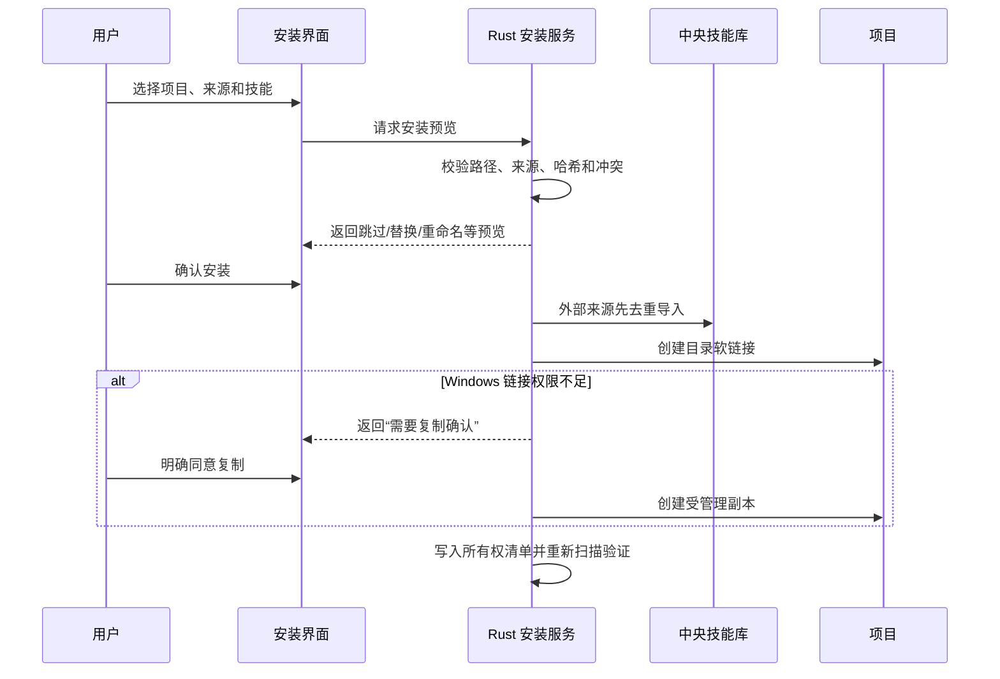

# skills-manager 桌面应用总体设计

> 文档版本：0.11.0
>
> 状态：当前有效
>
> 最后更新：2026-07-26

## 1. 产品定位

skills-manager 是一个基于 Tauri 的跨平台 AI Agent Skills 桌面管理工具。它以中央技能库为规范化来源，同时管理项目、平台适配、技能集合、技能包、分类标签、更新和趋势发现。

核心目标：

- 在一个界面管理多个 AI 开发工具和龙虾平台的 Skills。
- 把“扫描发现已有技能”和“添加项目作为安装目标”分开。
- 任意已存在的目录都可以注册为项目，不要求是 Git 仓库，也不要求预先安装 Skills。
- 外部来源先去重导入中央技能库，再安装到项目或平台。
- 多技能仓库既保留完整技能包身份，也允许搜索、筛选和选择其中的单个技能。
- 对安装、更新和卸载保留来源、内容哈希和应用所有权，避免误删用户文件。

命名约定：

- **中央技能库**：`~/.agents/skills/` 中的规范化技能。
- **项目**：用户明确添加并可接收 Skills 的任意本地目录。
- **扫描目录**：只用于发现已有 Skills，不等同于项目。
- **技能包**：一个完整来源仓库及其包含的一个或多个子技能。
- **技能集合**：用户维护的可复用技能选择，不代表来源或版本边界。

## 2. 当前技术栈

| 层 | 技术 | 用途 |
| --- | --- | --- |
| 桌面容器 | Tauri 2 | 窗口、系统能力和 Windows 打包 |
| 后端 | Rust | 文件扫描、链接、导入、更新、趋势采集和安全校验 |
| 前端 | React 18 + TypeScript + Vite | 页面与交互 |
| UI | Tailwind CSS 4 + shadcn/ui | 组件和响应式布局 |
| 状态 | Zustand | 页面状态、项目、技能包、治理和趋势数据 |
| 持久化 | SQLite / sqlx | 技能、项目、来源、安装清单、趋势快照等 |
| 包管理 | pnpm workspace | 前端依赖与构建 |

## 3. 总体架构

后端采用领域命令分组：

- `projects`：项目注册、扫描、安装预览、批量安装、同步和卸载。
- `packages`：技能包查询、包内技能关系及项目安装。
- `taxonomy`：自动分类、标签和人工覆盖。
- `updates`：中央技能更新检查、单个更新和批量更新。
- `trends`：市场快照刷新、7 天/30 天趋势计算及来源降级。
- `agents`：平台检测、自定义平台与启用状态。
- `scanner` / `discover`：中央库、平台目录和自定义扫描目录的技能发现。
- `github_import`：仓库预览、冲突处理、技能与完整包导入。
- `linker`：受管理链接和副本操作。

## 4. 信息架构

一级页面包括：

1. **中央技能库**：浏览、分类、筛选、排序、更新及安装到项目/平台。
2. **项目**：管理任意项目目录以及项目级 Skills。
3. **发现**：扫描配置目录中已经存在的 Skills。
4. **技能市场**：按来源和 7 天/30 天窗口查看趋势候选。
5. **技能集合**：维护可复用的技能组合并批量安装。
6. **设置**：扫描目录、平台、趋势凭据及界面配置。

侧边栏同时展示技能分类入口。平台入口只统计当前启用的平台；排序规则为 Codex 固定第一，其余优先显示本机检测到的平台，再按产品优先级和名称排序。

当前内置支持范围：

- 编程类：Codex、Claude Code、Cursor、GitHub Copilot、Gemini CLI、OpenCode、Windsurf、Trae、Qwen Code、Kiro。
- 龙虾类：OpenClaw、QClaw、EasyClaw、WorkBuddy。
- 中央技能库作为独立系统入口，不计入可安装平台数量。
- 历史内置平台记录为兼容已有数据保留，但默认停用且不进入展示统计。
- 用户仍可添加自定义平台。

## 5. 核心领域模型

### 5.1 技能与来源

技能记录保存名称、说明、内容、实际路径、中央库状态和扫描时间。`skill_sources` 保存规范化来源、仓库、引用、提交、内容哈希和更新时间，为去重和更新提供依据。

去重规则：

- 同一规范化来源或相同内容哈希：复用已有中央技能。
- 同名且内容相同：跳过重复写入。
- 同名但内容不同：要求显式选择跳过、替换或重命名。
- 不允许用来源名称代替内容校验。

### 5.2 项目

`projects` 保存规范化绝对路径、显示名称、Git 状态、访问状态和检查时间。项目可以为空。

项目中的技能分为：

- **观察到的技能实例**：扫描发现，应用不一定拥有。
- **受管理安装**：由应用创建，记录链接/副本、来源、内容哈希和安装状态。

只有受管理安装可以由应用卸载。移除项目记录不会删除项目目录或其中的用户文件。

### 5.3 技能包

多技能仓库以技能包作为来源、版本、更新和卸载边界。技能包保存完整仓库快照、来源 URL、Git 引用、提交、许可证和内容哈希。

包内子技能仍是：

- 搜索和筛选单元；
- 分类与标签单元；
- 项目安装时的选择单元。

默认整体安装技能包，但允许取消非必选子技能。包含 Hooks、插件清单或未验证原生变更的包不会自动执行脚本。

### 5.4 分类与标签

应用读取技能名称、说明和正文进行规则分类，并保存分类、标签、置信度和分类来源。分类结果可人工覆盖，人工结果不会被下一次自动分类覆盖。

分类用于：

- 主界面侧边栏；
- 中央技能库和项目安装弹窗；
- 技能集合选择；
- 搜索、展示和筛选。

### 5.5 更新

中央技能库根据规范化来源和内容状态展示：

- 可更新；
- 已是最新；
- 本地已修改；
- 来源不可检查；
- 检查失败。

用户可以按“有更新”筛选，并执行单个或批量更新。本地修改和来源冲突不得被静默覆盖。

### 5.6 趋势市场

趋势市场是发现入口，不直接作为项目安装来源。用户选中外部技能后，必须先导入中央技能库，再进入正常项目安装事务。

- GitHub：保存每日快照，以两个快照的 Star 数相减得到真实 7 天/30 天增量。
- 冷启动或历史不足：允许显示估算，但必须标记“趋势估算”。
- X：使用可选 Bearer Token；不可用时只影响 X 来源。
- Hugging Face：只接纳能够解析 `SKILL.md` 或明确指向技能仓库的候选。
- 各来源独立返回状态和错误，单一来源失败不能阻塞其他来源。

## 6. 安装与卸载设计

### 6.1 项目安装来源优先级

“安装技能到项目”弹窗固定按以下顺序提供来源：

1. 中央技能库；
2. 技能集合；
3. 外部导入。

中央技能库支持多选批量安装。技能集合安装复用相同的预览与冲突处理流程。外部链接或本地目录必须先导入中央技能库并完成去重。

### 6.2 安装事务

Windows 优先使用目录软链接。失败时不得静默复制；只有用户明确确认后才创建副本。受管理副本可以根据中央来源同步。

### 6.3 卸载

- 只删除安装清单中由应用拥有的链接或副本。
- 卸载前重新校验目标仍在项目范围内。
- 原生存在、来源不明或已被用户替换的目录不得自动删除。
- 卸载技能包时以包安装记录为边界，并保留未由该包拥有的内容。

## 7. 关键界面规范

### 7.1 项目页

- 项目列表和项目详情采用主从布局。
- 空状态直接提供“选择目录”和“手动输入路径”。
- 明确说明无需 Git、无需已有 Skills。
- 项目详情展示扫描到的技能、安装方式、同步状态和安全卸载入口。

### 7.2 中央技能库

- 支持关键词、分类、标签、更新状态筛选。
- 支持按名称、更新时间和本地项目使用次数排序。
- 同一项目中的多个平台适配路径只计一次使用。
- 卡片提供安装到项目、安装到平台、加入集合和查看详情入口。
- 平台摘要只统计当前启用平台。

### 7.3 项目安装弹窗

- 宽度不得被长技能名称或说明撑出视口。
- 最大高度受当前视口约束。
- 技能列表作为独立滚动区，禁止横向溢出。
- 标题、来源切换和底部安装操作区保持可见。
- 在常见 Windows 窗口尺寸下必须始终能够选中并点击安装/确定按钮。

### 7.4 技能市场

- 明确展示来源、统计窗口、真实趋势或估算状态。
- 提供 GitHub、X、Hugging Face、可信推荐和订阅源的独立筛选。
- 市场不提供绕过中央库的“直接安装到项目”操作。

## 8. 数据持久化

0.11.0 在既有 `skills`、`skill_installations`、`agents`、`collections`、`scan_directories` 和 `settings` 基础上，使用以下核心表：

| 表 | 作用 |
| --- | --- |
| `projects` | 用户明确注册的项目 |
| `project_skill_instances` | 项目扫描观察结果 |
| `project_skill_installations` | 受管理的项目安装及所有权 |
| `skill_taxonomy` / `skill_tags` | 分类、标签及人工覆盖 |
| `skill_sources` | 规范化来源、哈希和更新信息 |
| `skill_packages` / `package_skills` | 完整技能包及子技能关系 |
| `package_platform_adapters` | 包级平台适配与风险状态 |
| `project_package_installations` | 项目中的技能包安装 |
| `marketplace_trend_snapshots` | 市场历史快照 |
| `marketplace_subscriptions` | 用户订阅的市场来源 |

迁移全部采用幂等初始化，不自动把扫描目录转成项目，也不移动或删除现有中央技能文件。

## 9. 安全边界

- 所有外部和项目路径必须规范化并进行包含关系检查。
- 拒绝路径穿越、中央库外覆盖和嵌套符号链接逃逸。
- 外部仓库导入期间不得执行仓库脚本。
- 未验证清单或包含 Hooks 的技能包只允许安全的通用技能导入。
- 更新使用暂存和安全替换；本地修改不得静默丢失。
- 删除操作必须以应用所有权记录为依据。

## 10. 当前状态与验证

0.11.0 已实现：

- 任意项目目录注册、扫描和项目级卸载；
- 中央技能库/技能集合优先的批量项目安装；
- 外部来源先进入中央库的去重流程；
- 技能包及包内技能管理；
- 分类标签和侧边栏分类；
- 更新检查、筛选和单个/批量更新；
- 本地项目使用次数排序；
- 多来源趋势市场和快照模型；
- 平台启用范围、检测和本地优先排序；
- Windows 项目安装弹窗的视口适配。

迁移细节见[0.11.0 数据迁移说明](migrations/0.11.0-数据迁移说明.md)，验证结果和 Windows 产物见[0.11.0 测试验证记录](testing/0.11.0-测试验证记录.md)。
